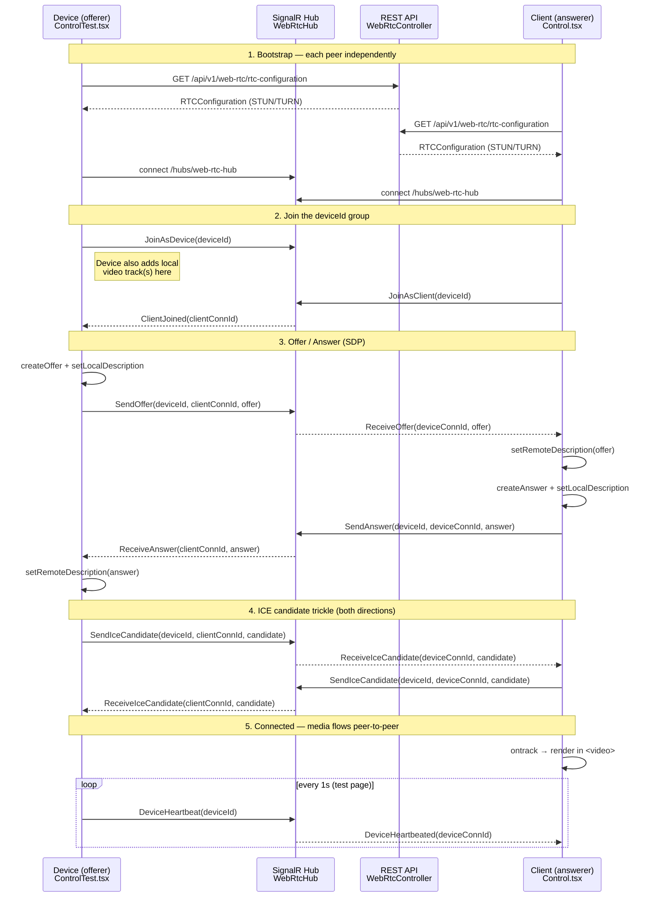

# WebRTC Signaling

This document describes how the two WebRTC peers in Scarlet Radio Control discover
each other and negotiate a peer‑to‑peer connection. The web app is **not** a media
server — it only performs *signaling*: it relays the SDP offer/answer and ICE
candidates between the two peers so they can establish a direct connection. Once
the connection is up, the video flows peer‑to‑peer (or through a TURN relay) and no
longer touches the web app.

## Roles

There are two peers, and they play asymmetric roles:

| Peer       | Frontend page                                                                 | WebRTC role      | Media direction |
| ---------- | ----------------------------------------------------------------------------- | ---------------- | --------------- |
| **Device** | [`ControlTest.tsx`](../src/ScarletRadioControl.Web.Frontend/src/pages/device/ControlTest.tsx) | Offerer / caller | **Sends** video |
| **Client** | [`Control.tsx`](../src/ScarletRadioControl.Web.Frontend/src/pages/device/Control.tsx)         | Answerer / callee | **Receives** video |

The **Device** owns the camera/stream (in the test page it captures a looping
`countdown.mp4`), adds the media tracks to its `RTCPeerConnection`, and creates the
**offer**. The **Client** is a viewer: it receives the offer, produces the
**answer**, and renders the incoming track in a `<video>` element.

Both peers are matched by a shared `deviceId` (taken from the route param), which is
used as the SignalR group name.

## Components

| Component              | File                                                                                                 | Responsibility                                                       |
| ---------------------- | ---------------------------------------------------------------------------------------------------- | ------------------------------------------------------------------- |
| Signaling hub          | [`WebRtcHub.cs`](../src/ScarletRadioControl.Web/Hubs/WebRtcHub.cs)                                    | SignalR hub that groups peers by `deviceId` and relays SDP/ICE.     |
| ICE config endpoint    | [`WebRtcController.cs`](../src/ScarletRadioControl.Web/Controllers/API/V1/WebRtcController.cs)        | Serves the STUN/TURN `RTCConfiguration` over REST.                  |
| Hub registration       | [`Startup.cs`](../src/ScarletRadioControl.Web/Startup.cs)                                             | Maps the hub at `/hubs/web-rtc-hub`.                                |
| SignalR connection     | [`SignalRContext.tsx`](../src/ScarletRadioControl.Web.Frontend/src/contexts/SignalRContext.tsx)      | Builds and shares a single auto‑reconnecting `HubConnection`.       |
| Peer connection hook   | [`useRtcPeerConnection.tsx`](../src/ScarletRadioControl.Web.Frontend/src/hooks/useRtcPeerConnection.tsx) | Creates / disposes the `RTCPeerConnection` from the fetched config. |

### Transport endpoints

- **Signaling channel:** SignalR hub at `/hubs/web-rtc-hub`. The frontend connects
  with `withAutomaticReconnect()`.
- **ICE configuration:** `GET /api/v1/web-rtc/rtc-configuration` returns an
  `RTCConfiguration` containing a Google STUN server plus Metered STUN/TURN servers.
  Both pages fetch this before creating the peer connection.

## End‑to‑end flow



### Step by step

1. **Bootstrap.** Each peer fetches the `RTCConfiguration` from the REST endpoint
   and opens the SignalR connection. The `RTCPeerConnection` is created once the
   config is available (`useRtcPeerConnection`).
2. **Join.** The Device calls `JoinAsDevice(deviceId)` and the Client calls
   `JoinAsClient(deviceId)`. Both are added to the SignalR group named `deviceId`.
   The Client's join fans out a `ClientJoined` notification to everyone already in
   the group — i.e. to the Device. The Device's join fans out `DeviceJoined`, which
   the Client currently only logs.
3. **Offer/Answer.** On receiving `ClientJoined`, the Device creates the SDP offer,
   sets it as its local description, and sends it to that specific client connection
   via `SendOffer`. The hub relays it as `ReceiveOffer`. The Client sets it as the
   remote description, creates the answer, sets it locally, and returns it via
   `SendAnswer` → `ReceiveAnswer`. The Device applies the answer as its remote
   description.
4. **ICE trickle.** As each peer's `onicecandidate` fires, it forwards the candidate
   to the other peer's connection id via `SendIceCandidate` → `ReceiveIceCandidate`.
   Candidates that arrive **before** the remote description is set are queued and
   flushed immediately after `setRemoteDescription` (see
   [ICE candidate buffering](#ice-candidate-buffering)).
5. **Connected.** When `connectionState === "connected"`, both pages read
   `getStats()` to surface the selected local/remote candidate types (`host` /
   `srflx` / `relay`). The Client renders the received stream via `ontrack`. The
   test Device page also emits a `DeviceHeartbeat` every second.

## Hub API reference

The hub is `Hub<IWebRtcClient>`. **Invocations** are methods the client calls on the
server; **callbacks** are methods the server pushes to clients (declared by
`IWebRtcClient`). In every relayed message, `fromConnectionId` is the SignalR
connection id of the *sending* peer, so the receiver knows where to address its
reply.

### Client → server (invocations)

| Method                                                      | Effect                                                                                        |
| ----------------------------------------------------------- | --------------------------------------------------------------------------------------------- |
| `JoinAsDevice(deviceId)`                                    | Adds the caller to group `deviceId`; sends `DeviceJoined(connectionId)` to others in group.   |
| `JoinAsClient(deviceId)`                                    | Adds the caller to group `deviceId`; sends `ClientJoined(connectionId)` to others in group.   |
| `SendOffer(deviceId, targetConnectionId, sdp)`             | Relays the SDP offer to `targetConnectionId` as `ReceiveOffer`.                               |
| `SendAnswer(deviceId, targetConnectionId, sdp)`            | Relays the SDP answer to `targetConnectionId` as `ReceiveAnswer`.                             |
| `SendIceCandidate(deviceId, targetConnectionId, candidate)`| Relays an ICE candidate to `targetConnectionId` as `ReceiveIceCandidate`.                     |
| `DeviceHeartbeat(deviceId)`                                 | Sends `DeviceHeartbeated(connectionId)` to others in group (liveness signal).                 |

### Server → client (callbacks)

| Callback                                        | Meaning                                                            |
| ----------------------------------------------- | ----------------------------------------------------------------- |
| `DeviceJoined(connectionId)`                    | A device joined the group.                                        |
| `ClientJoined(connectionId)`                    | A client joined the group — the Device's cue to create an offer.  |
| `ReceiveOffer(fromConnectionId, sdp)`           | An SDP offer from the peer.                                       |
| `ReceiveAnswer(fromConnectionId, sdp)`          | An SDP answer from the peer.                                      |
| `ReceiveIceCandidate(fromConnectionId, candidate)` | An ICE candidate from the peer.                                |
| `DeviceHeartbeated(fromConnectionId)`           | A device liveness heartbeat.                                     |

> **Routing note:** the `deviceId` argument on `SendOffer` / `SendAnswer` /
> `SendIceCandidate` is part of the wire contract but is not used by the hub for
> routing — those messages are addressed directly by `targetConnectionId`. The
> `deviceId` only matters for the `Join*` / `*Heartbeat` group operations.

## ICE candidate buffering

A remote ICE candidate can only be added after `setRemoteDescription` has run.
Because ICE trickle and the SDP exchange race each other, both pages buffer early
candidates:

- `ReceiveIceCandidate` adds the candidate immediately **if** `remoteDescription`
  is already set; otherwise it pushes it onto `rtcIceCandidateInitsRefObject`.
- After `setRemoteDescription` (in `ReceiveOffer` on the Client, `ReceiveAnswer` on
  the Device), a `flushPendingIceCandidates` helper drains the queue in order.

The remote peer's connection id is captured (`remotePeerConnectionIdRefObject`) from
whichever signaling message arrives first, so outbound candidates always have a
destination.

## Notes & caveats

- **Join ordering matters.** The Device only starts negotiation in response to
  `ClientJoined`. If a Client joins *before* the Device, the Device never learns
  about the already‑present client (it isn't re‑notified on its own join), and no
  offer is produced. In practice the Device should be present and joined first.
- **One peer of each role per group.** The signaling addresses a single remote
  connection id per side; multiple simultaneous clients or devices on the same
  `deviceId` are not modeled.
- **TURN credentials are hard‑coded** in `WebRtcController.cs` and shipped to every
  client that hits the config endpoint. That is inherent to how browser WebRTC
  consumes TURN, but the static long‑term credential is worth rotating / moving to
  configuration.
- **The web app is signaling‑only.** After the connection is established, media does
  not pass through the server; it goes peer‑to‑peer or via the TURN relay.
```
