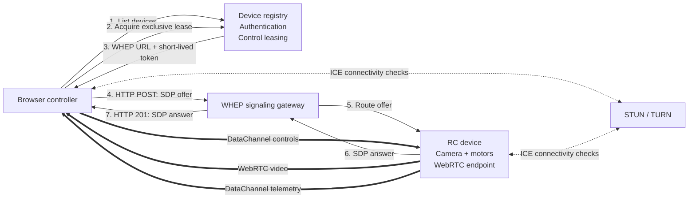

# WebRTC Teleoperation Architecture

## Device video to browser, browser controls to device

> **Terminology:** the protocol is **WHEP**—WebRTC-HTTP Egress Protocol—not “WHEIP.”

## 1. Executive summary

Your system has the following behavior:

```text
Device / RC car                         Browser
----------------                        ----------------
Camera video       ==================>  Live video display
Telemetry          ==================>  Speed, battery, status
Steering/throttle  <==================  Keyboard, gamepad, joystick
Commands           <==================  Arm, disarm, lights, mode
```

The closest standardized foundation is:

```text
Device selection:       Custom HTTPS API
Control ownership:      Custom exclusive-lease API
WebRTC signaling:       WHEP
Video transport:        WebRTC RTP/SRTP
Control transport:      WebRTC DataChannel
Telemetry transport:    WebRTC DataChannel
NAT traversal:          ICE, STUN and TURN
Authentication:         HTTPS bearer tokens
```

This is not a complete existing standard by itself. **WHEP establishes a WebRTC playback session**, but it does not define:

- How devices are listed.
- How a user selects a device.
- Who is allowed to control it.
- What a steering or throttle message looks like.
- What happens when control connectivity is lost.
- How an exclusive controller is chosen.

Those parts become an application-level **teleoperation profile built on WHEP**.

As of July 24, 2026, WHEP is `draft-ietf-wish-whep-04`, dated June 22, 2026. It is an active IETF Internet-Draft in Working Group Last Call and is not yet an RFC. The current draft defines HTTP-based SDP negotiation for WebRTC playback sessions. ([IETF Datatracker](https://datatracker.ietf.org/doc/draft-ietf-wish-whep/04/))

---

## 2. Why WHEP fits this use case

WHEP divides the two endpoints into these roles:

| WHEP role | Your system |
|---|---|
| WHEP player | Browser controller |
| WHEP endpoint | Device or device gateway |
| Media server | WebRTC stack sending the device camera |
| Playback media | Video from the device |
| HTTP session resource | One browser-to-device connection |

The browser initiates the session by sending an SDP offer to the WHEP endpoint. The endpoint normally returns an SDP answer and a URL representing the newly created session. After ICE and DTLS complete, media flows from the endpoint to the browser. ([IETF Datatracker](https://datatracker.ietf.org/doc/draft-ietf-wish-whep/04/))

WHEP describes audio and video as unidirectional playback media:

```text
Device  ───── video ─────> Browser
```

A WebRTC DataChannel, however, is bidirectional:

```text
Device  <──── data ──────> Browser
```

Therefore, one WebRTC PeerConnection can contain:

```text
m=video          Device → browser
m=application    Browser ↔ device
```

WebRTC DataChannels use SCTP over DTLS and support reliable, partially reliable, ordered and unordered delivery modes. ([RFC 8831](https://www.rfc-editor.org/rfc/rfc8831.html))

### Important WHEP caveat

The current WHEP draft allows an offer to contain a DataChannel `m=application` section, but the endpoint is allowed to reject it while still accepting audio or video. ([IETF Datatracker](https://datatracker.ietf.org/doc/draft-ietf-wish-whep/04/))

Your teleoperation profile must therefore add this rule:

> The WebRTC DataChannel is mandatory. If the WHEP answer rejects the `m=application` section, the browser must terminate the session and must not offer control.

WHEP alone treats the DataChannel as optional. Your teleoperation profile must treat it as required.

---

## 3. Overall architecture



The signaling gateway and the device can be the same component. For an Internet-connected vehicle, however, it is often easier for the device to maintain an outbound connection to a cloud gateway.

That produces this internal arrangement:

```text
Browser
   |
   | HTTPS / WHEP
   v
Cloud signaling gateway
   |
   | Persistent outbound device connection
   | WebSocket, MQTT, gRPC, or another internal protocol
   v
Device
```

The cloud gateway transports SDP between the browser and device. Once signaling completes, WebRTC can connect:

- Directly between the browser and device.
- Through a TURN relay.
- Through a media infrastructure component, depending on the deployment.

---

## 4. Separate the system into four planes

A clean implementation should treat the following as separate concerns.

| Plane | Purpose | Suggested protocol |
|---|---|---|
| Management plane | Users, devices, permissions and availability | HTTPS/JSON |
| Signaling plane | SDP, ICE and WebRTC session lifecycle | WHEP |
| Real-time transport plane | Video, control messages and telemetry | WebRTC |
| Physical control plane | Motor control, braking and local safety | Device-local control loop |

### 4.1 Management plane

This handles:

```text
Who is the user?
Which devices are online?
Which device did the user select?
Is the user allowed to view it?
Is the user allowed to control it?
Does another user currently control it?
```

WHEP does not answer these questions.

### 4.2 Signaling plane

This handles:

```text
Which video codecs are supported?
Which ICE candidates are available?
Which DTLS certificate fingerprint should be used?
Is an SCTP DataChannel association required?
Where is the WHEP session resource?
```

### 4.3 Real-time transport plane

This carries:

```text
Video frames
Steering values
Throttle values
Brake values
Telemetry
Control acknowledgements
Device events
```

Control messages should not be sent through WHEP HTTP `PATCH` operations. WHEP `PATCH` is intended for ICE-related signaling, not continuous application commands. ([IETF Datatracker](https://datatracker.ietf.org/doc/draft-ietf-wish-whep/04/))

### 4.4 Physical control plane

The network callback should not directly manipulate motors.

A safer design is:

```text
DataChannel message
        |
        v
Validation and authorization
        |
        v
Latest desired-control state
        |
        v
Fixed-rate local control loop
        |
        v
Motor controller
```

The physical control loop remains local to the device and applies speed limits, acceleration limits, braking rules and failsafe behavior even when the browser sends incorrect data.

---

## 5. Device discovery and control leasing

A browser must be able to select a device before it creates the WHEP session.

A minimal management API might expose:

```text
GET    /api/v1/devices
GET    /api/v1/devices/{deviceId}
POST   /api/v1/devices/{deviceId}/control-leases
PATCH  /api/v1/control-leases/{leaseId}
DELETE /api/v1/control-leases/{leaseId}
```

### 5.1 List available devices

#### Request

```http
GET /api/v1/devices?status=online HTTP/1.1
Host: control.example.com
Authorization: Bearer <user-token>
Accept: application/json
```

#### Response

```json
{
  "devices": [
    {
      "id": "car-17",
      "displayName": "Warehouse Car 17",
      "online": true,
      "controlStatus": "available",
      "controlProfile": "teleop.drive.v1",
      "capabilities": {
        "video": true,
        "audio": false,
        "telemetry": true,
        "maximumControlRateHz": 50
      }
    },
    {
      "id": "car-18",
      "displayName": "Warehouse Car 18",
      "online": true,
      "controlStatus": "in-use",
      "controlProfile": "teleop.drive.v1",
      "capabilities": {
        "video": true,
        "audio": true,
        "telemetry": true,
        "maximumControlRateHz": 30
      }
    }
  ]
}
```

`controlStatus` is management information. It is not part of WHEP.

### 5.2 Acquire an exclusive control lease

Before creating the WebRTC session, the browser requests permission to control the selected device.

#### Request

```http
POST /api/v1/devices/car-17/control-leases HTTP/1.1
Host: control.example.com
Authorization: Bearer <user-token>
Content-Type: application/json
Accept: application/json

{
  "mode": "exclusive-control",
  "requestedDurationSeconds": 60
}
```

#### Response

```json
{
  "leaseId": "lease-294da8e3",
  "deviceId": "car-17",
  "mode": "exclusive-control",
  "expiresAt": "2026-07-24T16:31:00Z",
  "whepEndpoint": "https://media.example.com/devices/car-17/whep",
  "accessToken": "<short-lived-session-token>",
  "controlProfile": "teleop.drive.v1",
  "safety": {
    "controlTimeoutMs": 250,
    "requiresExplicitArm": true
  },
  "iceServers": [
    {
      "urls": ["stun:stun.example.com:3478"]
    },
    {
      "urls": ["turn:turn.example.com:3478?transport=udp"],
      "username": "<temporary-username>",
      "credential": "<temporary-credential>"
    }
  ]
}
```

The returned token should be:

```text
Short-lived
Scoped to one device
Scoped to one lease
Scoped to view or control permissions
Unusable after lease expiration
Revocable by the server
```

A viewing-only user can be issued a different lease that does not authorize control.

---

## 6. Why an exclusive lease is necessary

A PeerConnection tells the device that a network peer exists. It does not inherently tell the device that this peer is the authorized controller.

Without a lease, two browsers could connect simultaneously and both send commands.

The lease creates an explicit ownership model:

```text
Device available
      |
      | lease granted
      v
Device reserved
      |
      | WebRTC connected
      v
Controller connected, device disarmed
      |
      | explicit arm command
      v
Controller active
      |
      | disconnect, timeout, revoke, or disarm
      v
Failsafe / disarmed
```

The device should bind the authenticated WebRTC session to the lease during signaling. It should not trust a `leaseId` merely because a DataChannel message contains one.

### Recommended ownership rules

| Condition | Device behavior |
|---|---|
| No lease | Reject control session |
| Valid viewing lease | Allow video, reject control |
| Valid control lease | Allow video and control |
| Another controller owns lease | Return conflict |
| Lease expires | Enter failsafe and close session |
| Administrator revokes lease | Enter failsafe immediately |
| Device disconnects | Release or invalidate lease |
| Browser disconnects | Enter failsafe and release lease |

---

## 7. WHEP session setup

The WHEP endpoint is associated with the selected device:

```text
https://media.example.com/devices/car-17/whep
```

The browser does not send a JSON body to this endpoint. It sends raw SDP with:

```http
Content-Type: application/sdp
```

### 7.1 Browser creates its PeerConnection

Before producing the SDP offer, the browser creates:

1. A receive-only video transceiver.
2. The required DataChannels.
3. Its ICE configuration.

```javascript
const pc = new RTCPeerConnection({
  bundlePolicy: "max-bundle",
  iceServers
});

pc.addTransceiver("video", {
  direction: "recvonly"
});

const controlChannel = pc.createDataChannel("teleop.control.v1", {
  ordered: false,
  maxPacketLifeTime: 100
});

const commandChannel = pc.createDataChannel("teleop.command.v1", {
  ordered: true
});

const telemetryChannel = pc.createDataChannel("teleop.telemetry.v1", {
  ordered: false,
  maxPacketLifeTime: 500
});

const eventChannel = pc.createDataChannel("teleop.events.v1", {
  ordered: true
});
```

Creating the DataChannels before the initial offer ensures that the offer contains the required SCTP/DataChannel `m=application` section.

The WebRTC API allows applications to configure ordering, a maximum packet lifetime or a maximum retransmission count. `maxPacketLifeTime` and `maxRetransmits` cannot both be specified for the same channel. ([W3C WebRTC](https://www.w3.org/TR/webrtc/))

### 7.2 Conceptual SDP offer

The browser generates SDP resembling:

```sdp
v=0
o=- ...
s=-
t=0 0

m=video 9 UDP/TLS/RTP/SAVPF 96 97 98
a=mid:0
a=recvonly
a=rtcp-mux
a=ice-ufrag:...
a=ice-pwd:...
a=fingerprint:sha-256 ...

m=application 9 UDP/DTLS/SCTP webrtc-datachannel
a=mid:1
a=sctp-port:5000
a=ice-ufrag:...
a=ice-pwd:...
a=fingerprint:sha-256 ...
```

The application should let `RTCPeerConnection` generate and process SDP. Manually rewriting browser-generated SDP should be avoided unless there is a very specific interoperability requirement.

### 7.3 Browser sends the offer

```http
POST /devices/car-17/whep HTTP/1.1
Host: media.example.com
Authorization: Bearer <short-lived-session-token>
Content-Type: application/sdp
Accept: application/sdp

v=0
o=- ...
```

A successful WHEP endpoint normally responds with:

```http
HTTP/1.1 201 Created
Content-Type: application/sdp
Location: /sessions/whep/4cb01972
ETag: "ice-session-1"

v=0
o=- ...
```

The response body is the SDP answer. The `Location` header identifies the session resource used for later `PATCH` or `DELETE` operations. This request and response model is defined by the WHEP draft. ([IETF Datatracker](https://datatracker.ietf.org/doc/draft-ietf-wish-whep/04/))

### 7.4 SDP answer requirements

The answer should contain:

```text
Video accepted as device → browser
DataChannel association accepted
Device ICE candidates
Device DTLS fingerprint
Compatible video codec
```

Conceptually:

```sdp
m=video 9 UDP/TLS/RTP/SAVPF 96
a=mid:0
a=sendonly

m=application 9 UDP/DTLS/SCTP webrtc-datachannel
a=mid:1
a=sctp-port:5000
```

If the answer instead contains:

```sdp
m=application 0 UDP/DTLS/SCTP webrtc-datachannel
```

the endpoint has rejected the DataChannel. The browser must treat the teleoperation session as unusable.

### 7.5 Current WHEP counter-offer behavior

The June 2026 WHEP draft also permits the endpoint to reject the browser’s offer with:

```http
HTTP/1.1 406 Not Acceptable
Content-Type: application/sdp
Location: /sessions/whep/pending-123
```

The response body then contains a new server-generated SDP offer. The browser generates an answer and sends it to the session URL with HTTP `PATCH`. A fully conforming client for the current draft must understand both the normal `201 Created` path and this `406` counter-offer path. ([IETF Datatracker](https://datatracker.ietf.org/doc/draft-ietf-wish-whep/04/))

For a first implementation in which you control both sides, the endpoint can always accept compatible browser offers and return `201 Created`.

---

## 8. Browser connection example

The following example uses non-trickle ICE for clarity. It waits until the browser has gathered its candidates before posting the SDP. Trickle ICE reduces setup time but requires additional WHEP `PATCH` handling.

```javascript
/**
 * Wait until the browser has finished gathering local ICE candidates.
 */
function waitForIceGatheringComplete(pc) {
  if (pc.iceGatheringState === "complete") {
    return Promise.resolve();
  }

  return new Promise((resolve) => {
    const handleStateChange = () => {
      if (pc.iceGatheringState === "complete") {
        pc.removeEventListener(
          "icegatheringstatechange",
          handleStateChange
        );
        resolve();
      }
    };

    pc.addEventListener(
      "icegatheringstatechange",
      handleStateChange
    );
  });
}

/**
 * Connect a browser controller to a selected device.
 */
async function connectToDevice({
  whepEndpoint,
  accessToken,
  iceServers,
  videoElement,
  onTelemetry,
  onEvent
}) {
  const pc = new RTCPeerConnection({
    bundlePolicy: "max-bundle",
    iceServers
  });

  let sessionUrl = null;
  let closed = false;

  // The browser only receives video.
  pc.addTransceiver("video", {
    direction: "recvonly"
  });

  // Rapid state updates: stale packets should expire quickly.
  const control = pc.createDataChannel("teleop.control.v1", {
    ordered: false,
    maxPacketLifeTime: 100
  });

  // One-shot state-changing commands: reliable and ordered.
  const command = pc.createDataChannel("teleop.command.v1", {
    ordered: true
  });

  // Frequent device measurements.
  const telemetry = pc.createDataChannel("teleop.telemetry.v1", {
    ordered: false,
    maxPacketLifeTime: 500
  });

  // Errors and command results.
  const events = pc.createDataChannel("teleop.events.v1", {
    ordered: true
  });

  telemetry.addEventListener("message", ({ data }) => {
    try {
      onTelemetry(JSON.parse(data));
    } catch (error) {
      console.error("Invalid telemetry message", error);
    }
  });

  events.addEventListener("message", ({ data }) => {
    try {
      onEvent(JSON.parse(data));
    } catch (error) {
      console.error("Invalid event message", error);
    }
  });

  pc.addEventListener("track", ({ track, streams }) => {
    if (track.kind !== "video") {
      return;
    }

    if (streams.length > 0) {
      videoElement.srcObject = streams[0];
    } else {
      videoElement.srcObject = new MediaStream([track]);
    }
  });

  pc.addEventListener("connectionstatechange", () => {
    console.log("WebRTC connection state:", pc.connectionState);

    if (
      pc.connectionState === "failed" ||
      pc.connectionState === "closed"
    ) {
      // The device must also independently enter its failsafe state.
      console.warn("Control connection is no longer usable");
    }
  });

  const offer = await pc.createOffer();
  await pc.setLocalDescription(offer);
  await waitForIceGatheringComplete(pc);

  const response = await fetch(whepEndpoint, {
    method: "POST",
    headers: {
      "Authorization": `Bearer ${accessToken}`,
      "Content-Type": "application/sdp",
      "Accept": "application/sdp"
    },
    body: pc.localDescription.sdp
  });

  if (response.status === 406) {
    throw new Error(
      "The endpoint returned a WHEP counter-offer; " +
      "this minimal client does not implement that path."
    );
  }

  if (response.status !== 201) {
    const details = await response.text();
    throw new Error(
      `WHEP session failed: HTTP ${response.status}: ${details}`
    );
  }

  const location = response.headers.get("Location");

  if (!location) {
    throw new Error("WHEP response did not contain Location");
  }

  sessionUrl = new URL(location, whepEndpoint).href;

  const answerSdp = await response.text();

  await pc.setRemoteDescription({
    type: "answer",
    sdp: answerSdp
  });

  // Confirm that SCTP/DataChannel negotiation was accepted.
  if (!pc.sctp) {
    await close();
    throw new Error(
      "The endpoint accepted video but rejected the DataChannel"
    );
  }

  async function close() {
    if (closed) {
      return;
    }

    closed = true;

    // Best-effort remote session cleanup.
    if (sessionUrl) {
      try {
        await fetch(sessionUrl, {
          method: "DELETE",
          headers: {
            "Authorization": `Bearer ${accessToken}`
          }
        });
      } catch (error) {
        console.warn("Could not delete WHEP session", error);
      }
    }

    control.close();
    command.close();
    telemetry.close();
    events.close();
    pc.close();
  }

  return {
    pc,
    control,
    command,
    telemetry,
    events,
    close
  };
}
```

WHEP defines HTTP `DELETE` on the session URL as the explicit session-termination operation. The endpoint must also support CORS-related `OPTIONS` requests when it is called from a browser origin. ([IETF Datatracker](https://datatracker.ietf.org/doc/draft-ietf-wish-whep/04/))

In a browser deployment, the server will normally need to expose headers such as:

```text
Location
ETag
Link
```

and allow methods and request headers such as:

```text
POST
PATCH
DELETE
OPTIONS
Authorization
Content-Type
```

---

## 9. Trickle ICE

The previous code waits for all browser ICE candidates before sending the initial offer. That is easy to implement but can increase connection setup time.

With Trickle ICE:

1. The browser sends its initial offer early.
2. The endpoint returns its complete candidate list in the SDP answer.
3. The browser sends additional browser-side candidates through HTTP `PATCH`.
4. The `PATCH` body uses `application/trickle-ice-sdpfrag`.

The WHEP draft recommends support for Trickle ICE and ICE restarts, although they remain optional protocol features. It also specifies that the endpoint includes its full candidate list in the answer rather than trickling server candidates back to the browser later. ([IETF Datatracker](https://datatracker.ietf.org/doc/draft-ietf-wish-whep/04/))

A candidate update resembles:

```http
PATCH /sessions/whep/4cb01972 HTTP/1.1
Host: media.example.com
Authorization: Bearer <short-lived-session-token>
If-Match: "ice-session-1"
Content-Type: application/trickle-ice-sdpfrag

a=group:BUNDLE 0 1
m=video 9 UDP/TLS/RTP/SAVPF 96
a=mid:0
a=ice-ufrag:abc123
a=ice-pwd:xyz456
a=candidate:...
```

For an initial prototype, non-trickle ICE is reasonable. For a production teleoperation system in which fast connection setup matters, implement Trickle ICE.

---

## 10. DataChannel design

Using a single channel for everything is possible, but different message categories have different reliability requirements.

A better profile uses several logical channels.

| Channel | Direction | Ordered | Reliability | Purpose |
|---|---:|---:|---|---|
| `teleop.control.v1` | Browser → device | No | Short lifetime | Steering, throttle, brake |
| `teleop.command.v1` | Browser → device | Yes | Reliable | Arm, disarm, lights, modes |
| `teleop.telemetry.v1` | Device → browser | Usually no | Partial | Battery, speed, temperature |
| `teleop.events.v1` | Device → browser | Yes | Reliable | Errors, acknowledgements, state changes |

DataChannels are bidirectional, so the direction shown in the table is an application convention rather than a transport limitation.

### 10.1 Why control updates should be partially reliable

Consider these steering updates:

```text
Packet 100: steering = -0.8
Packet 101: steering = -0.3
Packet 102: steering =  0.0
```

Suppose packet 100 is temporarily lost.

With reliable ordered delivery, packets 101 and 102 may wait behind packet 100. By the time packet 100 is retransmitted, its value is already obsolete.

For continuous controls, the desired behavior is usually:

```text
Use the newest state available.
Discard old state.
Do not build a backlog.
```

That maps well to:

```javascript
{
  ordered: false,
  maxPacketLifeTime: 100
}
```

The WebRTC DataChannel protocols explicitly support partially reliable unordered delivery with a maximum lifetime. ([RFC 8832](https://www.rfc-editor.org/rfc/rfc8832.html))

### 10.2 Commands need different semantics

An `arm` or `set-mode` command is not a continuously refreshed state. It should normally arrive once, in order, and receive an explicit result.

That maps to a reliable ordered channel:

```javascript
pc.createDataChannel("teleop.command.v1", {
  ordered: true
});
```

Examples include:

```text
Arm
Disarm
Set operating mode
Turn lights on
Start recording
Request calibration
Reset a non-safety subsystem
```

---

## 11. Control message format

For an initial implementation, JSON is easy to debug.

A control packet can represent the complete desired state:

```json
{
  "v": 1,
  "type": "control",
  "seq": 48302,
  "enabled": true,
  "steering": -0.24,
  "throttle": 0.38,
  "brake": 0.0,
  "aux": {
    "cameraPan": 0.1,
    "cameraTilt": -0.2
  }
}
```

### Field semantics

| Field | Meaning |
|---|---|
| `v` | Application protocol version |
| `type` | Message category |
| `seq` | Monotonically increasing control sequence |
| `enabled` | Deadman/control-enable state |
| `steering` | Normalized steering, normally `-1.0` to `1.0` |
| `throttle` | Normalized forward demand |
| `brake` | Normalized braking demand |
| `aux` | Optional device-specific control values |

The packet represents the current desired state. It does not mean:

```text
“Add 0.24 to the current steering.”
```

It means:

```text
“The current steering target is -0.24.”
```

This makes packet loss easier to tolerate because the next packet replaces the previous target.

### 11.1 Sequence handling

The device should remember the newest accepted sequence number:

```text
lastAcceptedSequence = 48302
```

It should reject:

```text
seq <= lastAcceptedSequence
```

subject to the chosen integer rollover rules.

This prevents a delayed packet from overriding newer control state.

### 11.2 Do not depend on synchronized clocks

The browser and device may not have synchronized clocks. Therefore, a browser timestamp should not be the only mechanism used to decide whether a packet is safe to apply.

Use:

```text
Sequence number
Device-local receive time
Device-local watchdog timer
```

Timestamps can still be included for diagnostics and latency measurement.

---

## 12. Sending controls from the browser

The browser should send a complete control state at a fixed interval rather than emitting a network packet for every keyboard or gamepad event.

An example is 30 updates per second:

```javascript
class ControlSender {
  constructor(channel) {
    this.channel = channel;
    this.sequence = 0;

    this.state = {
      enabled: false,
      steering: 0,
      throttle: 0,
      brake: 0
    };

    // Avoid letting old control packets accumulate.
    this.maxBufferedBytes = 16 * 1024;
  }

  update(partialState) {
    this.state = {
      ...this.state,
      ...partialState
    };
  }

  start() {
    if (this.timer) {
      return;
    }

    this.timer = setInterval(() => {
      this.sendCurrentState();
    }, 1000 / 30);
  }

  stop() {
    clearInterval(this.timer);
    this.timer = null;

    this.state = {
      enabled: false,
      steering: 0,
      throttle: 0,
      brake: 1
    };

    this.sendCurrentState();
  }

  sendCurrentState() {
    if (this.channel.readyState !== "open") {
      return;
    }

    // For state updates, dropping a packet is better than queuing
    // a large backlog of stale steering commands.
    if (this.channel.bufferedAmount > this.maxBufferedBytes) {
      return;
    }

    const message = {
      v: 1,
      type: "control",
      seq: ++this.sequence,
      ...this.state
    };

    this.channel.send(JSON.stringify(message));
  }
}
```

`RTCDataChannel.bufferedAmount` reports data waiting to be sent, and `bufferedAmountLowThreshold` can be used to receive a notification when the queue falls below a selected threshold. ([W3C WebRTC](https://www.w3.org/TR/webrtc/))

The exact control frequency depends on the vehicle dynamics and network conditions. It should be negotiated or published as part of the device capability profile rather than hard-coded across every device model.

---

## 13. Command messages

A command should have a unique identifier:

```json
{
  "v": 1,
  "type": "command",
  "commandId": "cmd-d69895dd",
  "name": "arm",
  "arguments": {}
}
```

The device responds on the event channel:

```json
{
  "v": 1,
  "type": "command-result",
  "commandId": "cmd-d69895dd",
  "status": "accepted",
  "deviceState": "armed"
}
```

An error result might be:

```json
{
  "v": 1,
  "type": "command-result",
  "commandId": "cmd-d69895dd",
  "status": "rejected",
  "error": {
    "code": "CONTROL_NOT_NEUTRAL",
    "message": "Throttle and steering must be neutral before arming"
  }
}
```

The device should make command processing idempotent where practical. If the same `commandId` arrives twice, it should return the previously determined result instead of executing the operation twice.

---

## 14. Telemetry messages

A telemetry packet might contain:

```json
{
  "v": 1,
  "type": "telemetry",
  "deviceSeq": 992741,
  "ackControlSeq": 48302,
  "deviceState": "armed",
  "speedMps": 2.81,
  "battery": {
    "fraction": 0.71,
    "voltage": 11.8
  },
  "motors": {
    "leftCurrentA": 2.4,
    "rightCurrentA": 2.6
  },
  "network": {
    "controlPacketsReceived": 48190
  },
  "failsafe": {
    "active": false,
    "reason": null
  }
}
```

`ackControlSeq` lets the browser know the latest control state processed by the device. It is more efficient than acknowledging every control packet with a separate message.

Telemetry should not generally block waiting for lost older telemetry. A current battery or speed measurement is usually more useful than a delayed older measurement.

Important events should use the reliable event channel:

```json
{
  "v": 1,
  "type": "event",
  "eventId": "evt-a18e3",
  "name": "failsafe-entered",
  "severity": "critical",
  "reason": "CONTROL_TIMEOUT",
  "deviceState": "disarmed"
}
```

---

## 15. Application-level handshake

The DataChannel becoming `open` proves that the transport exists. It does not prove that both endpoints understand the same teleoperation protocol.

After opening, the device can send:

```json
{
  "v": 1,
  "type": "hello",
  "deviceId": "car-17",
  "controlProfiles": [
    "teleop.drive.v1"
  ],
  "controlTimeoutMs": 250,
  "maximumControlRateHz": 50,
  "requiresExplicitArm": true
}
```

The browser responds:

```json
{
  "v": 1,
  "type": "controller-ready",
  "selectedProfile": "teleop.drive.v1",
  "requestedControlRateHz": 30
}
```

Only after this exchange should the interface enable the arm control.

This gives you two levels of capability checking:

```text
Management API:
What the server believes the device supports.

DataChannel handshake:
What the connected device actually supports.
```

---

## 16. Device-side processing

Conceptually, the device performs:

```text
Receive authenticated WHEP offer
        |
Validate lease and device identity
        |
Create PeerConnection
        |
Attach camera video track
        |
Apply browser SDP offer
        |
Accept SCTP/DataChannel m-section
        |
Generate SDP answer
        |
Return answer through WHEP endpoint
        |
Wait for ICE + DTLS + DataChannels
        |
Run application handshake
        |
Remain disarmed until explicitly armed
```

Device-side pseudocode:

```text
function handleWhepOffer(request):
    lease = authenticateAndResolveLease(request.token)

    if lease.deviceId != thisDevice.id:
        reject(403)

    if lease.expired:
        reject(401)

    if lease.mode != "exclusive-control":
        reject(403)

    peer = createPeerConnection()

    peer.addVideoTrack(cameraTrack, direction = SEND_ONLY)

    peer.onDataChannel = handleDataChannel

    peer.setRemoteDescription(request.sdpOffer)

    answer = peer.createAnswer()

    assert answerAcceptsVideo()
    assert answerAcceptsSctpDataChannel()

    peer.setLocalDescription(answer)

    session = createWhepSessionResource(
        peer = peer,
        lease = lease
    )

    return HTTP_201(
        body = peer.localDescription,
        location = session.url
    )
```

When the control channel opens:

```text
function handleControlMessage(rawMessage):
    message = decode(rawMessage)

    if not validSchema(message):
        recordProtocolError()
        return

    if not session.leaseIsValid():
        enterFailsafe("LEASE_INVALID")
        return

    if message.seq <= lastAcceptedSeq:
        return

    if not finiteAndWithinBounds(message):
        recordProtocolError()
        return

    lastAcceptedSeq = message.seq
    lastValidControlReceiveTime = monotonicNow()

    latestDesiredState = sanitize(message)
```

A separate local loop applies the newest accepted state:

```text
every 10 milliseconds:
    if not deviceIsArmed:
        commandMotorsSafe()
        continue

    elapsed = monotonicNow() - lastValidControlReceiveTime

    if elapsed > controlTimeout:
        enterFailsafe("CONTROL_TIMEOUT")
        continue

    applyLocalLimits(latestDesiredState)
    updateMotorController(latestDesiredState)
```

---

## 17. Failsafe requirements

For a remotely controlled vehicle, the absence of commands must itself be treated as a stop condition.

Sending a remote “stop” packet is not sufficient because that packet can also be lost.

The device should enter a safe state when any of these occurs:

| Failure | Required reaction |
|---|---|
| No valid control packets within timeout | Neutral throttle and brake |
| DataChannel closes | Immediate failsafe |
| PeerConnection fails | Immediate failsafe |
| Lease expires | Immediate failsafe |
| Lease is revoked | Immediate failsafe |
| Authentication becomes invalid | Immediate failsafe |
| Control sequence repeatedly malformed | Disarm or close session |
| Browser sends `enabled: false` | Neutral and disarm as configured |
| Device control process crashes | Hardware or supervisory failsafe |
| Physical emergency stop activates | Stop independently of network |

### Recommended layered safety

```text
Layer 1: Browser deadman control
Layer 2: DataChannel control watchdog
Layer 3: Lease expiration
Layer 4: Device-local speed and acceleration limits
Layer 5: Motor-controller watchdog
Layer 6: Physical emergency stop
```

The WebRTC connection should never be the only safety mechanism.

### Example arming policy

A safe arming operation can require:

```text
Valid exclusive lease
DataChannel handshake complete
Recent video received by browser
Throttle at zero
Brake engaged
Steering near neutral
No active device fault
Explicit user arm action
```

After arming, the browser continuously sends complete control states. If those updates stop, the device disarms automatically.

---

## 18. Video-loss behavior

The control channel and video track can fail differently.

Possible situations include:

```text
Control works but video freezes.
Video works but control channel closes.
Both remain connected but latency becomes excessive.
```

For a vehicle controlled primarily by live video, video freshness should be part of the browser’s control-enable policy.

The browser can monitor:

```text
Time of last decoded video frame
WebRTC inbound RTP statistics
Frame rate
Packet loss
Round-trip time
DataChannel queue size
Telemetry freshness
```

A sensible policy is:

```text
If no new video frame is rendered for the configured threshold:
    set enabled = false
    set throttle = 0
    set brake = safe value
```

The device-side watchdog remains necessary because the browser’s final disabled packet may never arrive.

---

## 19. Authentication and security

WHEP requires an HTTPS-based security model and defines support for HTTP bearer-token authentication. The token format and distribution mechanism remain application-specific. ([IETF Datatracker](https://datatracker.ietf.org/doc/draft-ietf-wish-whep/04/))

A session token should contain or reference:

```json
{
  "subject": "user-42",
  "deviceId": "car-17",
  "leaseId": "lease-294da8e3",
  "permissions": [
    "video:receive",
    "control:send",
    "telemetry:receive"
  ],
  "expiresAt": "2026-07-24T16:31:00Z"
}
```

The signaling gateway should verify that:

```text
The token is authentic.
The token has not expired.
The lease still exists.
The lease belongs to the selected device.
The user has control permission.
No conflicting controller is active.
```

The device should receive the verified authorization context from the trusted signaling path. It should not make authorization decisions solely from fields supplied through the DataChannel.

### Additional controls

| Control | Reason |
|---|---|
| Short-lived TURN credentials | Avoid permanent relay secrets |
| Random session URLs | Prevent session guessing |
| Rate limits on WHEP POST/PATCH | Prevent resource exhaustion |
| SDP and message-size limits | Prevent memory abuse |
| Control-rate limits | Prevent event flooding |
| Numeric range validation | Prevent unsafe actuator values |
| Audit events | Record lease, arm, disarm and failsafe transitions |
| Redacted logs | Avoid exposing SDP credentials and private addresses |

The WHEP draft specifically discusses HTTPS, bearer authentication, random session URLs and rate limiting for session operations. ([IETF Datatracker](https://datatracker.ietf.org/doc/draft-ietf-wish-whep/04/))

---

## 20. NAT traversal

The device and browser may both be behind NAT or firewalls.

WebRTC handles this using ICE:

```text
Host candidate:
A local address.

Server-reflexive candidate:
A public mapping discovered through STUN.

Relay candidate:
A TURN server address used to relay traffic.
```

WebRTC APIs and transports are designed to use ICE, STUN and TURN for this purpose. ([W3C WebRTC](https://www.w3.org/TR/webrtc/))

The preferred path is generally:

```text
Browser <──────── direct UDP ────────> Device
```

When direct connectivity does not work:

```text
Browser <──── TURN relay ────> Device
```

TURN is different from an SFU. A TURN server relays encrypted transport packets and does not need to decode the video or understand steering messages.

### Device connectivity model

The device does not need to accept arbitrary inbound Internet HTTP connections.

A practical model is:

```text
Device opens outbound TLS connection to cloud.
Device announces presence and capabilities.
Cloud receives the browser's WHEP offer.
Cloud routes the offer to the device.
Device creates the SDP answer.
Cloud returns the answer to the browser.
ICE connects browser and device directly or through TURN.
```

This works well for devices on mobile, residential or corporate networks.

---

## 21. Direct versus server-mediated deployment

### 21.1 Direct browser-to-device PeerConnection

```text
Browser <========== WebRTC ==========> Device
```

This is the preferred model when:

```text
Only one controller is expected.
Lowest latency is important.
The device can run a complete WebRTC endpoint.
The device can encode the camera feed.
TURN fallback is available.
```

The cloud handles authentication, discovery, leases and signaling, but the real-time packets travel directly or through TURN.

### 21.2 Device publishes through WHIP

An alternative is:

```text
Device ── WHIP ──> Media server ── WHEP ──> Browser
```

WHIP is now RFC 9725 and defines WebRTC ingestion into streaming services or CDNs. ([RFC 9725](https://www.rfc-editor.org/rfc/rfc9725.html))

This is useful when:

```text
Many users need to watch one device.
The video must be recorded centrally.
An SFU or media server is already available.
The device should publish only one encoded stream.
```

However, the control path then needs explicit design:

```text
Browser ── control ──> Control service ── control ──> Device
```

A DataChannel from the browser to the media server does not automatically become a DataChannel to the device’s separate WHIP session.

You would need one of:

```text
Server-side DataChannel relay
WebSocket control relay
MQTT control relay
A second direct WebRTC PeerConnection
```

### 21.3 Multiple viewers and one controller

A hybrid system can use:

```text
Device ── WHIP ──> SFU ── WHEP ──> Multiple viewers
       <──────── direct control PeerConnection ─────── Controller
```

This separates the video-distribution problem from the exclusive low-latency control problem.

---

## 22. WHEP limitations relevant to teleoperation

### 22.1 WHEP does not define device discovery

A WHEP URL identifies a playback endpoint. It does not define a fleet directory, device search or availability model.

You need the custom `/devices` API.

### 22.2 WHEP does not define control ownership

It does not know whether one or several users may control a device.

You need the control lease.

### 22.3 WHEP does not define control messages

It does not define steering, throttle, braking, telemetry or failsafe semantics.

You need the DataChannel application protocol.

### 22.4 DataChannels can be rejected

The current draft explicitly allows a WHEP endpoint to accept video but reject a DataChannel `m=` section. Your profile must make successful DataChannel negotiation mandatory. ([IETF Datatracker](https://datatracker.ietf.org/doc/draft-ietf-wish-whep/04/))

### 22.5 General SDP renegotiation is not supported

The current WHEP draft does not support changing the SDP media sections after initial negotiation; only ICE-related information can be updated. ([IETF Datatracker](https://datatracker.ietf.org/doc/draft-ietf-wish-whep/04/))

Therefore, negotiate everything you will need at the start:

```text
Video
Optional audio
SCTP/DataChannel association
Expected codec capabilities
```

Creating additional logical DataChannels over an already-negotiated SCTP association may be possible through the DataChannel establishment mechanism, but the safest profile is to establish all required channels immediately.

### 22.6 WHEP is still a draft

Because WHEP is not yet an RFC, production implementations should identify the supported WHEP revision or interoperability profile.

For example:

```json
{
  "signalingProfile": "draft-ietf-wish-whep-04",
  "teleoperationProfile": "teleop.drive.v1"
}
```

---

## 23. Proposed teleoperation profile

You could define an internal protocol called:

```text
WebRTC Teleoperation Profile version 1
```

or:

```text
WHEP-Teleop/1
```

It would not be an official IETF standard unless separately standardized, but it would clearly specify how your implementations interoperate.

### 23.1 Profile definition

```yaml
profile: teleop.drive.v1

signaling:
  base: draft-ietf-wish-whep-04
  authentication: bearer-token
  required_media:
    - one receive-only video transceiver
    - one SCTP DataChannel association
  general_renegotiation: disabled
  ice_restart: supported
  trickle_ice: recommended

channels:
  control:
    label: teleop.control.v1
    ordered: false
    max_packet_lifetime_ms: 100
    direction: browser-to-device

  command:
    label: teleop.command.v1
    ordered: true
    reliable: true
    direction: browser-to-device

  telemetry:
    label: teleop.telemetry.v1
    ordered: false
    max_packet_lifetime_ms: 500
    direction: device-to-browser

  events:
    label: teleop.events.v1
    ordered: true
    reliable: true
    direction: device-to-browser

control:
  encoding: json
  minimum_rate_hz: 10
  preferred_rate_hz: 30
  maximum_rate_hz: 50
  state_model: absolute
  sequence_numbers: required
  stale_sequence_rejection: required

safety:
  exclusive_lease: required
  explicit_arm: required
  deadman_control: required
  device_watchdog: required
  local_limits: required
  physical_estop: recommended
```

The timing values are examples and should be selected according to the actual vehicle and safety analysis.

### 23.2 Normative-style rules

A cross-vendor profile could state:

```text
The browser MUST acquire a valid control lease before starting a
control-capable WHEP session.

The browser MUST include one receive-only video media section and
one WebRTC DataChannel application section in the initial SDP offer.

The endpoint MUST reject the session if the authenticated lease does
not authorize control of the selected device.

The endpoint MUST accept the DataChannel application section for a
control-capable session.

The device MUST remain disarmed until the application-level handshake
has completed and an explicit arm command has been accepted.

The browser MUST send complete control-state snapshots rather than
incremental steering or throttle deltas.

The device MUST reject stale control sequence numbers.

The device MUST enter its configured failsafe state if it does not
receive a valid control state within the negotiated watchdog interval.

The device MUST enter its failsafe state when the DataChannel,
PeerConnection, authorization or control lease becomes invalid.

The device MUST enforce actuator and motion limits locally.
```

---

## 24. Suggested first implementation

A practical first version would use:

```text
One browser controller
One device
Direct WebRTC PeerConnection
TURN fallback
Non-trickle ICE
WHEP POST + DELETE
One receive-only video track
Four DataChannels
JSON messages
Exclusive control lease
250 ms device watchdog
Explicit arm/disarm
30 Hz complete-state control packets
```

Once that works, add:

```text
Trickle ICE
ICE restarts
WHEP counter-offer support
Binary CBOR or Protobuf encoding
Video and control latency metrics
Lease renewal and revocation
Multiple viewing-only clients
Central recording or an SFU
Device failover and reconnect policies
```

---

## 25. Final protocol recommendation

The complete architecture should be described as:

> **A WHEP-based WebRTC teleoperation profile consisting of a device registry, an exclusive control-lease service, receive-only WebRTC video, bidirectional WebRTC DataChannels and device-local failsafe enforcement.**

The resulting protocol stack is:

```text
Application
├── Device discovery API
├── Authentication and authorization
├── Exclusive control lease
├── Teleoperation message protocol
└── Safety state machine

Signaling
└── WHEP over HTTPS

WebRTC
├── SDP / JSEP
├── ICE / STUN / TURN
├── DTLS
├── SRTP video
└── SCTP DataChannels

Device
├── Camera encoder
├── WebRTC endpoint
├── Control-message validator
├── Local control loop
├── Watchdog
└── Physical failsafe
```

WHEP provides the standardized session-establishment foundation. The DataChannel provides the low-latency control path. The custom teleoperation profile supplies the essential concepts that WHEP intentionally does not define: **device selection, control ownership, command semantics and safe failure behavior**.
